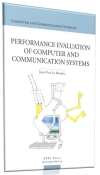

# Performance Evaluation Of Computer And Communication Systems


ISBN: 978-2-940222-40-7,2010


```
   @book{leboudec2010performance,
        title={Performance Evaluation of Computer and Communication Systems},
        author={Le Boudec, Jean-Yves},
        year={2010},
        publisher={EPFL Press, Lausanne, Switzerland},
        isbn={978-2-940222-40-7},
        doi={10.1201/b16328}
        }
```

### What this book is about

Performance Evaluation is often the critical part in evaluating the results of a research project. Many of us are familiar with simulations, but it is often difficult to address questions like

* I want to estimate a probability of error and I see no error in *n* experiments: what can I say about the error probability ?
* I would like to characterize the fairness of my protocol. Should I use Jain's Fairness Index or the Lorenz Curve Gap ?
* Should I eliminate the beginning of the simulation in order to wait until the system stabilizes ?
* I would like to fit an explanatory model to my data, I was told to use least squares for that; is that the right thing to do ? Why ?
* I simulate a random way point model but the average speed in my simulation is not as expected. What happened ?
the reviewers of my paper complained that I did not provide confidence intervals. What is that ? How do I get them ?
how do I analyze the power consumption of my system ?
* I would like to fit a distribution to the flow sizes that I measured but all my measurements are truncated to a maximum value; how do I account for the truncation?
* What is Palm calculus and why should I know about it ?

These and other questions are the topic of this book, which began as a set of lecture notes taught at EPFL.

### Download this book

* [Official publisher's version](https://infoscience.epfl.ch/record/146812/files/perfPublisherVersion_1.pdf?version=1) (pdf, non printable); [Errata](./errata/errata.pdf) for the publisher's version
* [Latest version](./book/perf.pdf) (less fancy formatting, but with bug fixes, printable.)

### Complementary Resources
* [Slides and videos](./slides/slides.html)
* [Exercises](./exos/exos.html) with solutions
* [Data files](./data/data.html)


